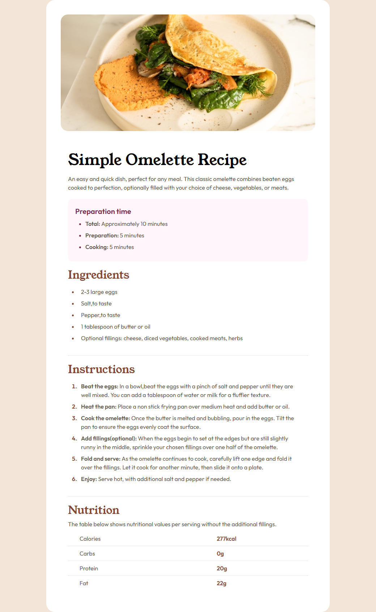
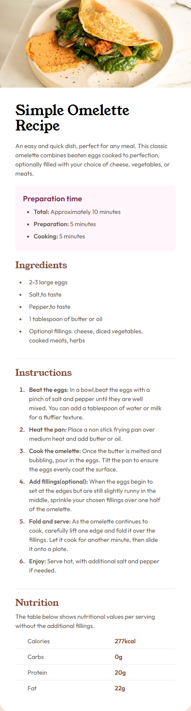

# Frontend Mentor - Recipe page solution

This is a solution to the [Recipe page challenge on Frontend Mentor](https://www.frontendmentor.io/challenges/recipe-page-KiTsR8QQKm). Frontend Mentor challenges help you improve your coding skills by building realistic projects.

## Table of contents

- [Overview](#overview)
  - [The challenge](#the-challenge)
  - [Screenshot](#screenshot)
  - [Links](#links)
- [My process](#my-process)
  - [Built with](#built-with)
  - [What I learned](#what-i-learned)
  - [Continued development](#continued-development)
  - [Useful resources](#useful-resources)
- [Author](#author)
- [Acknowledgments](#acknowledgments)

**Note: Delete this note and update the table of contents based on what sections you keep.**

## Overview

### the-challenge

this challenge is available on fronted mentor a website where new frontend developer take challege to practice what they learn. In this challenge i have to create the recipe page for both mobile and desktop.

### Screenshot




### Links

- Solution URL: [solution URL](https://github.com/acekant/Fm-recipe-page)
- Live Site URL: [live site URL](https://acekant.github.io/Fm-recipe-page/)

## My process

### Built with

- Semantic HTML5 markup
- CSS custom properties
- Flexbox
- Mobile-first workflow
- [Tailwind](https://tailwindcss.com/) - CSS Framework

### What I learned

In this challenge i learned that how to change color of list bullets

To see how you can add code snippets, see below:

```css
marker:text-Rose_800 (in tailwind)
or
ul {
  marker:hsl(14, 45%, 36%)
} (in CSS)
```

### Continued development

I would like to gain more experience in margin and padding like in sometimes they don't work for some element like table, span etc
I would also like to gain more knowledge in tailwind like animation

My future plant to enrich my skills are that make more and more project on css like from easy to complex with animations and other advance stuffs. I would like make clone like tesla, spotify and for animation website i would like to use figma template from figma.com

### Useful resources

- [Resource 1](https://developer.mozilla.org/en-US/docs/Web/CSS/::marker) - This helped me for define color of list's bullets

## Author

- Website - [Github](https://github.com/acekant)
- Frontend Mentor - [acekant](https://www.frontendmentor.io/profile/acekant)

## Acknowledgments

Traversy Media Youtube Channel
